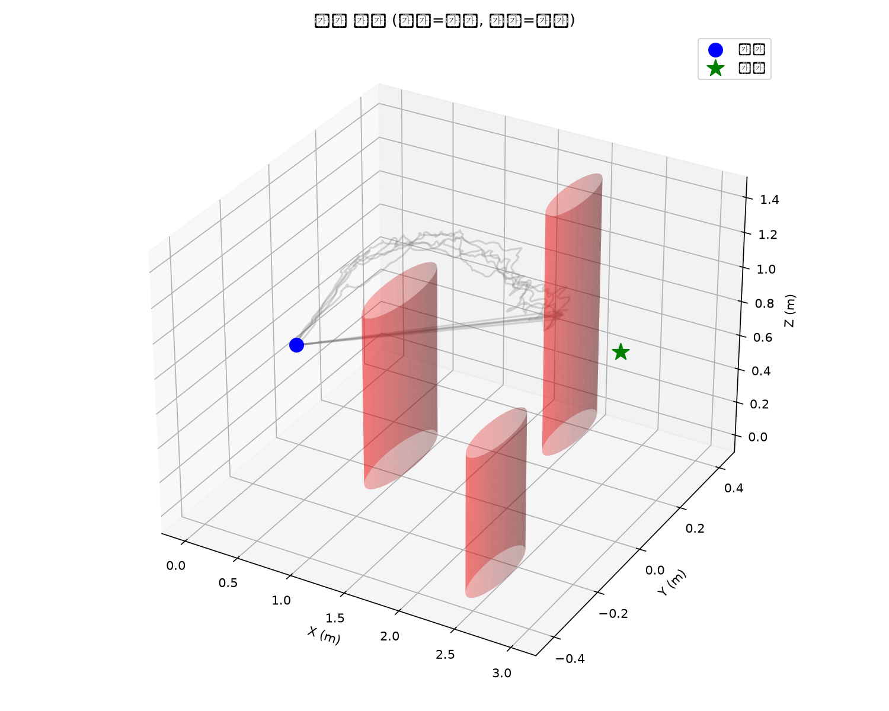
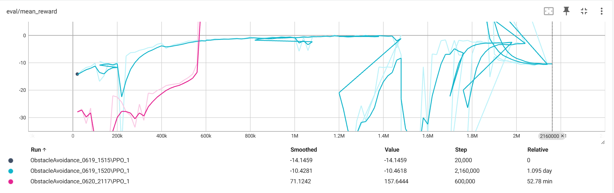
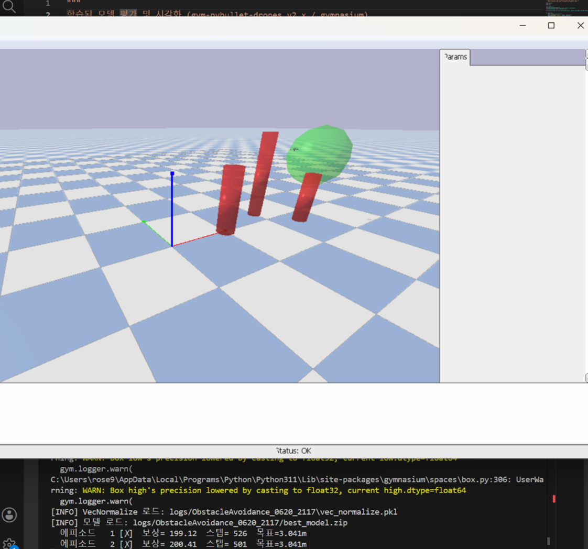
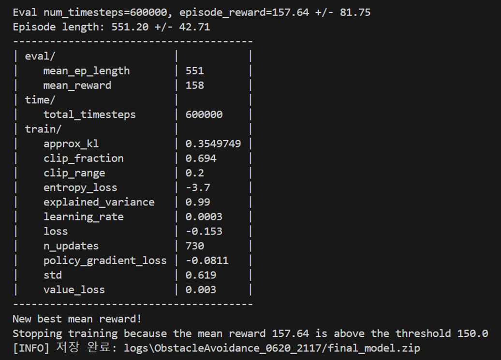

# Drone Obstacle Avoidance with PPO Reinforcement Learning


강화학습(PPO)을 이용한 드론 장애물 회피 자율 비행 시스템.
gym-pybullet-drones 기반 PyBullet 시뮬레이션 환경에서 학습.

## 드론 비행 궤적 (3D Trajectory)


> 파란 점: 시작점, 초록 별: 목표점, 빨간 원기둥: 장애물 3개

---

## 결과

| 지표 | 값 |
|------|-----|
| 총 학습 스텝 | 600,000 |
| 최종 eval 보상 | 157.64 (임계값 150 초과 → 자동 종료) |
| 평가 평균 보상 | 198.83 ± 1.21 (5회 에피소드) |
| 평균 에피소드 길이 | 532 스텝 / 최대 600 |
| 학습 소요 시간 | 약 52분 |

## 학습 보상 곡선 (eval/mean_reward)


## 시뮬레이션 환경 (PyBullet GUI)


## 학습 종료 터미널


---

## 환경 구성

- 시뮬레이터: gym-pybullet-drones v2.1.0 (PyBullet)
- 드론 모델: Crazyflie 2X (CF2X)
- 시작점 → 목표점: [0, 0, 0.5m] → [3, 0, 1.0m]
- 장애물: 원기둥 3개 (x=1.0m, 2.0m, 2.5m)
- 관측 공간: 18차원 (운동학 12 + 목표 방향 3 + 장애물 거리 3)
- 행동 공간: 4차원 속도 제어 (vx, vy, vz, yaw_rate)

## 보상 함수

| 항목 | 값 |
|------|-----|
| 진행 보상 | (이전 거리 - 현재 거리) × 10 |
| 도착 보너스 | +200 (목표 반경 0.5m 이내) |
| 충돌 패널티 | -50 |
| 경계 이탈 | -20 |
| 시간 패널티 | -0.05 / 스텝 |

---

## 설치

```bash
pip install stable-baselines3 gymnasium
pip install gym-pybullet-drones
```

## 실행

### 학습
```bash
python train.py
```

### 평가
```bash
python evaluate.py
```

---

## 파일 구조

```
UAV_CODE/
├── obstacle_avoidance_env.py   # 커스텀 강화학습 환경
├── train.py                    # PPO 학습 스크립트
├── evaluate.py                 # 평가 및 시각화
├── setup_and_run.sh            # 환경 설정 스크립트
└── logs/ObstacleAvoidance_0620_2117/
    ├── best_model.zip          # 학습된 모델
    └── vec_normalize.pkl       # 정규화 파라미터
```
